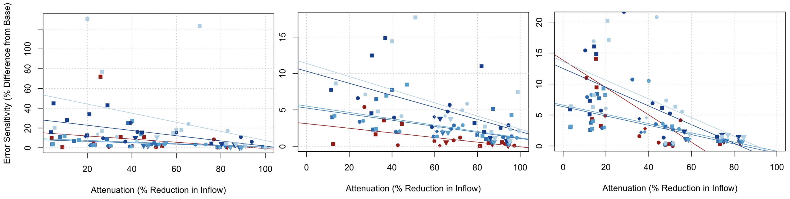
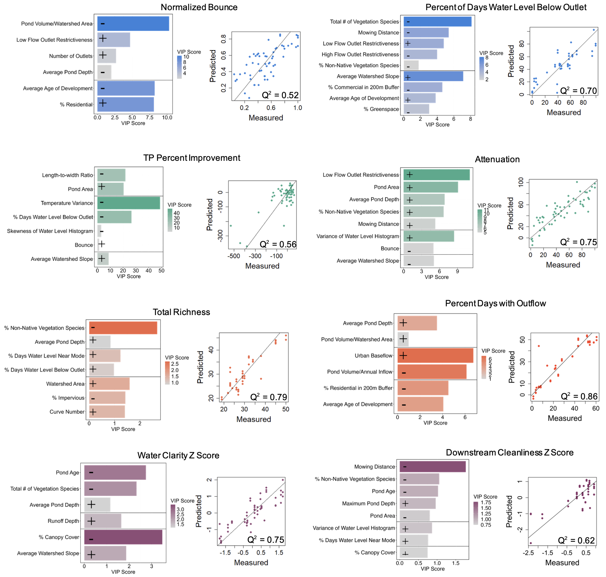



*Photographs taken at a stormwater pond in Madison, WI 3 months apart*

Urbanization significantly disrupts the natural hydrologic cycle by expanding impervious surfaces such as roads, buildings, and parking lots. Stormwater detention ponds combat challenges introduced by urban areas and play a vital role in contemporary stormwater management systems. These ponds are designed to temporarily hold stormwater runoff, controlling its release to reduce downstream flooding and improve water quality by enabling the settling of sediments and pollutants. In addition to their core purposes, detention ponds offer valuable but often overlooked ecosystem services. These include supporting biodiversity, preserving environmental flow regimes essential for downstream ecosystems, and enhancing urban aesthetics and recreational opportunities as a prominent source of natural spaces in cities. The effectiveness of these services depends on watershed characteristics, engineering design features, and the pond's hydrologic regime, which together create synergies and trade-offs both within the pond and downstream.

Reverse Routing in Stormwater Detention Ponds
====================

Reverse level pool routing is a technique used to estimate an inflow hydrograph when the outflow hydrograph and stage-storage characteristics of a reservoir are known. While traditionally applied in large river systems or reservoirs, this study modifies the method using a second-order trapezoidal approximation to suit stormwater detention pond systems. The method incorporates water level measurements, estimated stage-storage relationships, and standard outflow equations for structures like weirs and culverts. 

To test its accuracy, synthetic and observed water level data with varying levels of noise and bias were analyzed, evaluating how errors affect the computed inflows and outflows. Smoothing techniques were employed to minimize the impact of these errors. At each of the 20 study ponds, attenuation as percent difference in peak inflow to peak outflow was calculated for a variety of noise and bias scenarios and for a small, medium, and large storm. The error sensitivity as percent difference between the attenuation from each noise and bias scenario and the base attenuation with no noise and bias was also assessed.

***Figure 1:*** *Combined noise and bias error analysis for a less restrictive and restrictive pond in EPA-SWMM with reverse routing calculations*

***Figure 2:*** *Effects of 3-point average, 2-minute aggregated data, and 5-minute aggregated data smoothing on reverse routing calculations for typical noise added in a less restrictive and restrictive pond in EPA-SWMM*

***Figure 3:*** *Rating curves with shaded differences in outflow for the same change in stage, and plots of inflow, outflow, and stage showing the effects of adding typical noise and bias between -5cm and 5cm by 0.1cm and finding the maximum and minimum inflow and for a less restrictive and restrictive study pond in with reverse routing calculations*

***Figure 4:*** *Attenuation (% reduction in inflow) vs error sensitivity (% difference) in a small, medium, and large storm*

Key Findings:
------

1.	Noise has larger influence on inflow, bias has larger influence on outflow
2.	As attenuation increases by pond, error sensitivity in inflow and outflow tends to decrease
3.	Flow estimates will be more accurate in scenarios with:
    - More restrictive outlets
    - Medium-sized storms
    - More accurate pressure transducers (low typical noise)
    - Finer time resolutions

Drivers of Ecosystem Services in Stormwater Detention Ponds
=========

Partial Least Squares Regression (PLSR) was used to explore and predict relationships among variables. First, the relationships between engineering design and watershed predictors with hydrologic response variables were analyzed. Then, the models incorporated engineering design, watershed, and hydrologic predictors to examine their influence on ecosystem service indicator responses. Synergies and tradeoffs among and between in pond and downstream ecosystem service indicators were assessed by identifying commonly occurring hydrologic, engineering design, and watershed variables and exploring their relationships with each ecosystem services indicator.

***Figure 5:*** *PLSR model results including predicted vs measured plots, VIP scores, and the direction of relationship between predictor and response variables for hydrologic variables, and regulating, supporting, and cultural ecosystem services*

**Table 1:** VIP score for common predictor variables (columns) color coded by magnitude and direction of relationship with ecosystem service indicator response variable (row). Blank cells indicate that predictor variable was not included in the final model

Key Findings:
-----

1.	Engineering design variables tend to be stronger predictors of hydrologic variables than watershed characteristics
2.	Engineering design and hydrologic variables tend to be stronger predictors of ecosystem service indicators than the expected watershed characteristics
3.	Synergies and tradeoffs exist between ecosystem service indicators and design variables that can be changed to alter hydrologic regime and maximize ecosystem service function include increasing:
    - Residence time
    - Outlet restrictiveness
    - Pond size (area/depth)
    - Vegetation surrounding ponds
